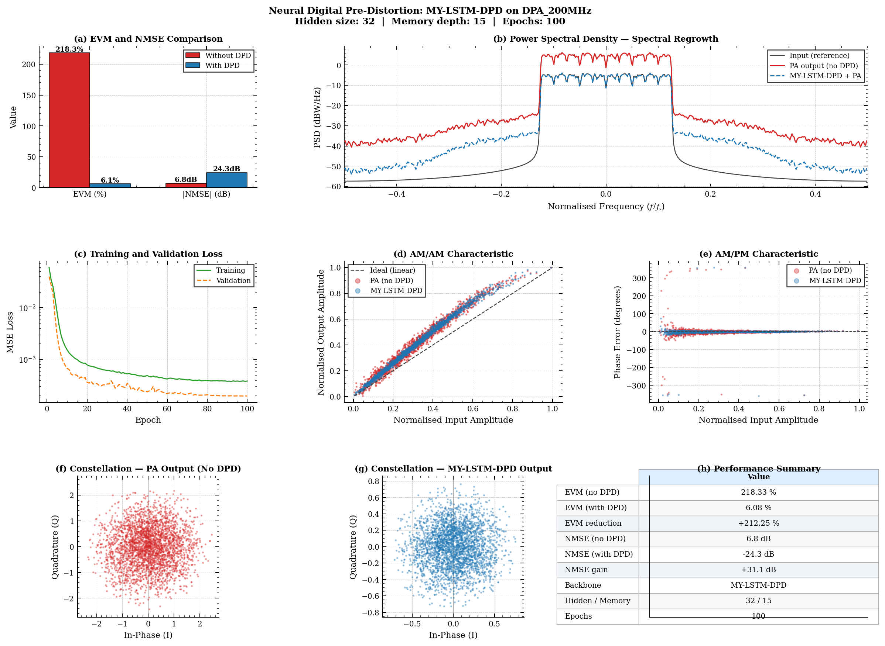

# Neural Digital Pre-Distortion (DPD)

Power amplifier linearization using LSTM and MLP neural networks, trained on real PA measurement data from the [dpdOpen](https://github.com/pa-predistortion/dpdOpen) dataset.

## Results

Evaluated on the DPA_200MHz dataset (10-carrier 64QAM, 200 MHz bandwidth, Doherty PA).

| Metric | Without DPD | With DPD | Improvement |
|--------|------------|----------|-------------|
| EVM | 218.3 % | 6.1 % | −97.2 % |
| NMSE | +6.8 dB | −24.3 dB | +31.1 dB |



## Project Structure

```
.
├── backbones/
│   └── my_dpd_backbone.py   # MyMLPDPD and MyLSTMDPD model definitions
├── datasets/
│   └── DPA_200MHz/          # Real PA measurement data (from dpdOpen)
├── run_my_dpd.py            # Training and evaluation script
├── results_my_dpd/          # Output plots and saved model weights
└── README.md
```

## Setup

```bash
git clone https://github.com/pa-predistortion/dpdOpen.git
cd dpdOpen
pip install -e .


cp my_dpd_backbone.py backbones/
cp run_my_dpd.py .
```

## Usage

```bash
python run_my_dpd.py --dataset DPA_200MHz --backbone my_lstm_dpd --hidden 32 --epochs 100

python run_my_dpd.py --dataset DPA_200MHz --backbone my_mlp_dpd --hidden 64 --epochs 100

python run_my_dpd.py --dataset DPA_200MHz --backbone my_lstm_dpd --device cuda --epochs 200
```

Outputs are saved to `results_my_dpd/`: the result plot, best checkpoint (`_best.pth`), and final weights (`_final.pth`).

## Models

**MyLSTMDPD** — Bidirectional LSTM with single-head scaled dot-product attention. Two stacked LSTM layers capture long-range PA memory effects; attention aggregates across the sequence before the output projection.

**MyMLPDPD** — Feedforward network with residual blocks. Flattens a sliding window of I/Q samples and passes them through stacked ResBlocks with LayerNorm and GELU activations.

Both models use the **indirect learning architecture**: the DPD is trained to approximate the inverse PA mapping (PA output → PA input), so that when composed with the real PA, the combined response is approximately linear.

## Key Arguments

| Argument | Default | Description |
|----------|---------|-------------|
| `--dataset` | `DPA_200MHz` | Dataset folder under `datasets/` |
| `--backbone` | `my_lstm_dpd` | Model: `my_lstm_dpd` or `my_mlp_dpd` |
| `--hidden` | `32` | Hidden layer size |
| `--seq_len` | `15` | Memory depth (samples) |
| `--epochs` | `100` | Training epochs |
| `--lr` | `5e-4` | Learning rate |
| `--device` | auto | `cpu` or `cuda` |

## Dependencies

- Python 3.8+
- PyTorch
- NumPy, SciPy, Matplotlib
- opendpd (`pip install -e .` from dpdOpen repo)
